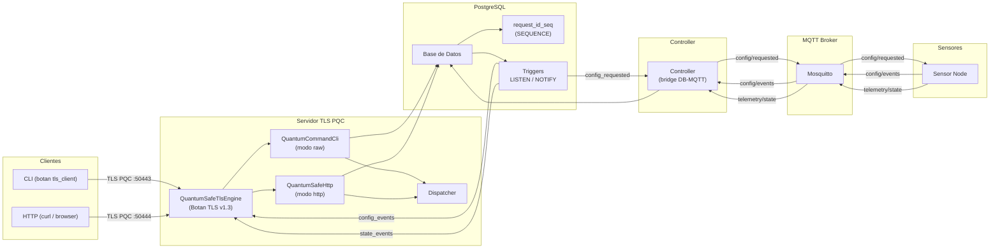
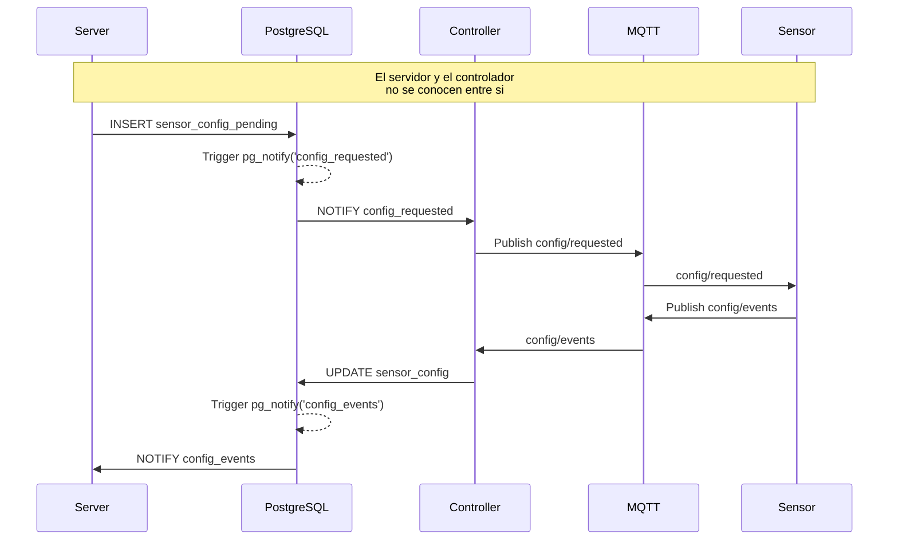
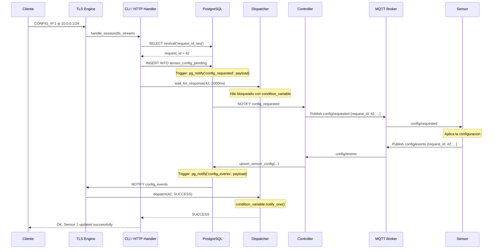
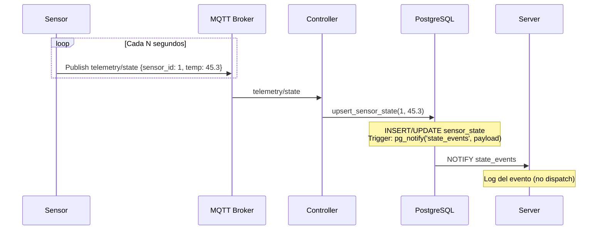
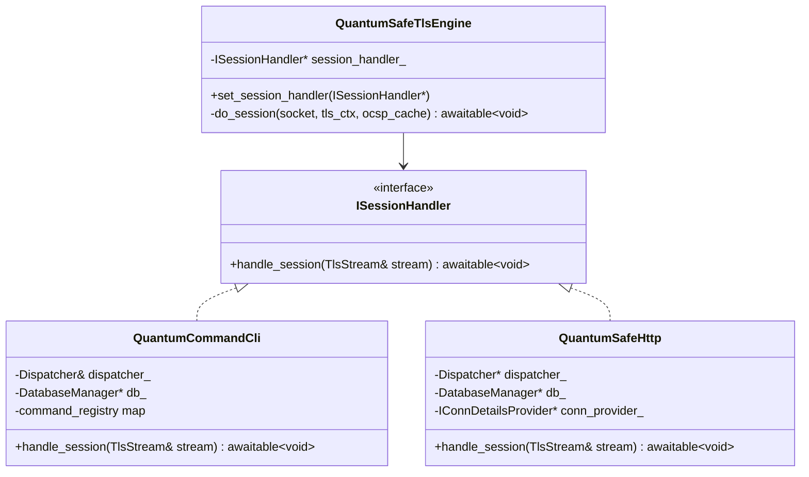
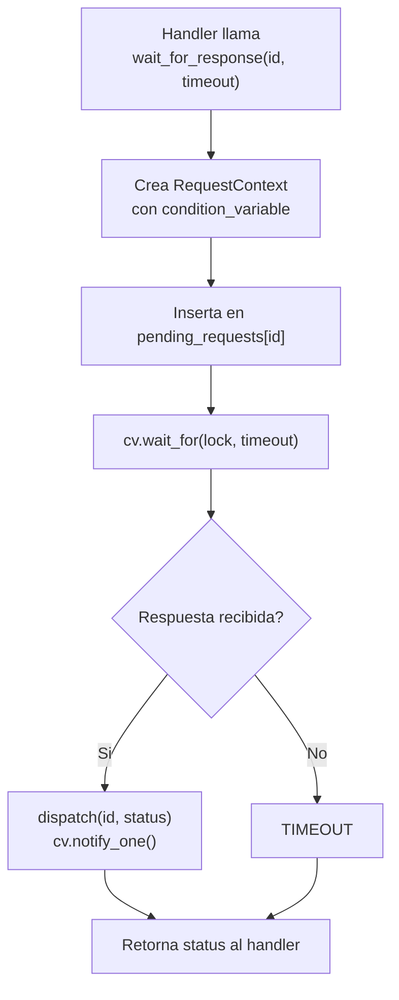
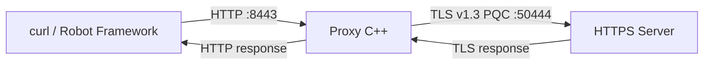

# Management Sensors -- Quantum-Safe IoT Platform

Sistema distribuido de gestión de sensores IoT con comunicaciones TLS v1.3
post-quantum (PQC), pipeline reactivo basado en PostgreSQL LISTEN/NOTIFY y
desacoplamiento total entre servidor y controlador mediante base de datos
como bus de eventos.

## Arquitectura General



## Componentes

| Componente | Directorio | Descripcion |
|---|---|---|
| **Server** | `server/` | Servidor TLS v1.3 PQC con dos modos: CLI raw y HTTP REST API |
| **Controller** | `controller/` | Bridge entre PostgreSQL (LISTEN/NOTIFY) y MQTT |
| **Sensor** | `sensor/` | Nodo IoT que publica telemetria y aplica configuraciones |
| **Proxy** | `proxy/` | Proxy HTTP -> TLS PQC para clientes no-PQC |
| **libs/db** | `libs/db/` | Libreria compartida de acceso a PostgreSQL |
| **libs/json** | `libs/json/` | Libreria compartida de pretty-print JSON |
| **common/** | `common/` | Headers compartidos (interfaces DB, logging, JSON) |

## Principio de Diseño: Desacoplamiento via Base de Datos Reactiva

El servidor y el controlador nunca se comunican directamente. PostgreSQL actua
como **bus de eventos** mediante el mecanismo LISTEN/NOTIFY:



Ventajas de esta arquitectura:

- **Desacoplamiento total**: el servidor se puede reiniciar sin afectar al
  controlador y viceversa. El estado persiste en la base de datos.
- **Escalabilidad horizontal**: multiples instancias de servidor pueden
  compartir la misma base de datos, con IDs generados por una SEQUENCE
  PostgreSQL como punto unico de autoridad.
- **Auditabilidad**: cada cambio de configuracion queda registrado en
  `sensor_config_pending` y `sensor_config`.
- **Tolerancia a fallos**: si el controlador se cae, las configuraciones
  pendientes permanecen en la tabla y pueden reprocesarse.

## Pipeline de Request: CONFIG_IP

Ejemplo completo del flujo cuando un usuario solicita cambiar la IP de un
sensor, tanto por CLI como por API REST:



### Diferencias entre CLI y HTTP

| Aspecto | CLI (raw) | HTTP REST |
|---|---|---|
| **Entrada** | `CONFIG_IP 1 ip 10.0.0.1/24` (texto plano sobre TLS) | `POST /api/config_ip {"sensor_id":1,"ip":"10.0.0.1/24"}` |
| **Respuesta** | `OK: Sensor 1 updated successfully.\n` | `200 {"status":"success","sensor_id":1,"request_id":42,"message":"..."}` |
| **Puerto** | 50443 (modo raw) | 50444 (modo http) |
| **Parser** | Tokenizacion por espacios | `boost::json::parse` |

Ambos comparten el mismo pipeline interno: `generate_request_id()` ->
`add_pending_config()` -> `wait_for_response()`.

## Pipeline de Telemetria

La telemetria fluye en sentido inverso, desde los sensores hasta la base de
datos, sin intervencion del servidor:



El servidor recibe la notificacion `state_events` pero actualmente solo la
registra en el log. La lectura de telemetria en tiempo real se puede hacer
consultando `sensor_state` directamente o suscribiendose al canal NOTIFY.

## Capa de Abstraccion NET: ISessionHandler

El `QuantumSafeTlsEngine` es agnostico al protocolo. Delega el manejo de
sesiones TLS a una interfaz abstracta:



El modo se selecciona con `--mode raw|http` al arrancar el servidor. Esto
permite ejecutar dos instancias en paralelo sobre puertos distintos, una para
cada modo, compartiendo la misma base de datos.

## Generacion de Request ID: PostgreSQL SEQUENCE

En un escenario con multiples instancias de servidor, la generacion de IDs
unicos no puede depender de contadores en memoria. El sistema delega esta
responsabilidad a PostgreSQL:

```
init_request_id_sequence()          -- Se ejecuta una vez al arrancar
  CREATE SEQUENCE IF NOT EXISTS request_id_seq;
  SELECT MAX(request_id) FROM sensor_config
  UNION SELECT MAX(request_id) FROM sensor_config_pending;
  SELECT setval('request_id_seq', max_id);

generate_request_id()               -- Se ejecuta por cada peticion
  SELECT nextval('request_id_seq');  -- Atomico, seguro entre conexiones
```

Esto garantiza IDs monotonicamente crecientes y unicos incluso con N
instancias de servidor concurrentes.

## Dispatcher: Patron Request/Response sobre Eventos Asincronos

El `Dispatcher` transforma un flujo asincrono (NOTIFY) en una llamada
sincrona bloqueante para el handler:



Limites de proteccion:
- Maximo 500 peticiones pendientes simultaneas (`MAX_PENDING`).
- Timeout configurable (por defecto 2 segundos).
- Si se supera el limite: retorna `SYSTEM_FULL`.

## TLS Post-Quantum con Botan

El servidor usa Botan 3 para TLS v1.3 con algoritmos post-quantum:

| Politica | KEX Groups | Uso |
|---|---|---|
| `pqc_basic.txt` | ML-KEM-768, ML-KEM-1024, x25519/ML-KEM-768 | Servidor (produccion) |
| `pqc_all.txt` | Kyber, eFrodoKEM, ML-KEM, hibridos clasicos+PQC | Servidor (compatibilidad) |
| `client_policies.txt` | Igual que pqc_all, solo TLS 1.3 | Clientes (bridge, proxy) |

Todas las politicas desactivan `require_cert_revocation_info` para
desarrollo. En produccion se deberia habilitar con CRL/OCSP.

### PKI (Infraestructura de Clave Publica)

Generada con `scripts/gen_certs.sh` usando el CLI de Botan:

```
CA (ca.key / ca.pem)
├── Server (server.key / server.pem)  CN=localhost
└── Client (client.key / client.pem)  CN=proxy-client
```

Algoritmo: ECDSA secp384r1, SHA-384. Certificados firmados por la CA.

## Proxy HTTP -> TLS PQC

Para clientes que no soportan TLS v1.3 PQC (curl, browsers), el proxy
traduce HTTP plano a TLS PQC:



El proxy presenta certificado de cliente (`client.pem`) para mutual TLS y
valida el certificado del servidor contra la CA.

## Dependencias

| Libreria | Version | Uso |
|---|---|---|
| [Botan](https://botan.randombit.net/) | 3.x | TLS v1.3 PQC, certificados, criptografia |
| [Boost](https://www.boost.org/) | >= 1.90.0 | Asio (networking), Beast (HTTP), JSON, coroutines |
| [PostgreSQL](https://www.postgresql.org/) | 18.x | Base de datos reactiva, LISTEN/NOTIFY, sequences |
| [libpqxx](https://pqxx.org/) | 7.x | Driver C++ para PostgreSQL |
| [Paho MQTT C/C++](https://eclipse.org/paho/) | latest | Comunicacion MQTT con sensores |
| [GTest / GMock](https://github.com/google/googletest) | latest | Tests unitarios y mocks |
| [Robot Framework](https://robotframework.org/) | latest | Tests E2E |

## Build

```bash
# Generar certificados
./scripts/gen_certs.sh

# Compilar
cmake -S . -B build
cmake --build build -j$(nproc)
```

## Run

```bash
# Servidor modo raw (CLI)
./build/server/server \
  --cert server/certs/server.pem --key server/certs/server.key \
  --port 50443 --policy server/policies/pqc_basic.txt --mode raw

# Servidor modo HTTP (API REST)
./build/server/server \
  --cert server/certs/server.pem --key server/certs/server.key \
  --port 50444 --policy server/policies/pqc_basic.txt --mode http

# Controller
./build/controller/controller

# Sensor
./build/sensor/sensor

# Proxy HTTP -> TLS PQC
./build/proxy/proxy \
  --listen-port 8443 --backend-host 127.0.0.1 --backend-port 50444 \
  --ca server/certs/ca.pem --cert server/certs/client.pem \
  --key server/certs/client.key --policy server/policies/pqc_basic.txt
```

### Ejemplo de uso: CLI

```bash
botan tls_client localhost --port=50443 \
  --policy=server/policies/client_policies.txt --trusted-cas=server/certs/
# > CONFIG_IP 1 ip 10.0.0.1/24
# OK: Sensor 1 updated successfully.
```

### Ejemplo de uso: API REST

El tráfico sigue yendo al **proxy** en HTTP (`:8443`), que lo encapsula en **TLS v1.3 PQC** hacia el servidor (`:50444`). Sobre ese canal, los endpoints bajo `/api/*` (salvo login) exigen un **JWT** firmado con **ES384** (`Authorization: Bearer …`). Detalle normativo: `security/README.md` §1.3.

**1. Obtener token** — `POST /api/auth/login` (público; cuerpo JSON):

```bash
curl -s -X POST http://127.0.0.1:8443/api/auth/login \
  -H "Content-Type: application/json" \
  -d '{"username":"admin","password":"admin"}'
# {"status":"success","token":"<JWT>","expires_in":3600}
```

> Credenciales de arranque `admin` / `admin` (sustituir por validación real en producción; ver `UAUTH-*` en `security/README.md`).

Guarda el valor de `token` (con `jq`, o cópialo del JSON de la respuesta):

```bash
TOKEN=$(curl -s -X POST http://127.0.0.1:8443/api/auth/login \
  -H "Content-Type: application/json" \
  -d '{"username":"admin","password":"admin"}' | jq -r '.token')
```

**2. Llamadas protegidas** — incluir siempre `Authorization: Bearer <JWT>`:

```bash
curl -s -X POST http://127.0.0.1:8443/api/config_ip \
  -H "Content-Type: application/json" \
  -H "Authorization: Bearer ${TOKEN}" \
  -d '{"sensor_id":1,"ip":"10.0.0.1/24"}'
# {"status":"success","sensor_id":1,"request_id":42,"message":"Configuration applied"}
```

Otros endpoints protegidos (mismo header):

```bash
curl -s http://127.0.0.1:8443/api/connection_details \
  -H "Authorization: Bearer ${TOKEN}"
```

**Errores habituales:** sin `Authorization`, token mal formado, caducado o firma inválida → **401** (y `WWW-Authenticate: Bearer` cuando aplica). Claves JWT: `scripts/gen_certs.sh` genera `jwt.key` / `jwt.pem` junto a los certificados TLS.

## Tests

### Tests Unitarios (GTest)

```bash
cmake --build build --target dispatcher_tests db_tests mock_db_tests json_tests
./build/tests/gtests/dispatcher_tests
./build/tests/gtests/db_tests
./build/tests/gtests/mock_db_tests
./build/tests/gtests/json_tests
```

| Suite | Descripcion |
|---|---|
| `dispatcher_tests` | Logica del Dispatcher (timeout, dispatch, sistema lleno) |
| `db_tests` | Acceso real a PostgreSQL (sanity, sequences, upsert) |
| `mock_db_tests` | Pipeline con DatabaseManager mockeado (GMock) |
| `json_tests` | Pretty-print JSON con validacion via `boost::json::parse` |

### Tests E2E (Robot Framework)

```bash
robot tests/robot/tests/
```

La infraestructura de test arranca automaticamente:

- PostgreSQL
- Servidor raw (:50443) + servidor HTTPS (:50444)
- Bridge botan/socat (:2000)
- Proxy HTTP->TLS (:8443)
- Controller + Sensor

| Suite | Descripcion |
|---|---|
| `00_management.robot` | CLI: conectividad PostgreSQL, CONFIG_IP, stress, carga paralela |
| `01_https_api.robot` | API REST: config_ip exitoso, body invalido, campos faltantes, 404 |

## Logging

Cada proceso escribe su propio fichero de log en `logs/`:

```
logs/server.log
logs/controller.log
logs/sensor.log
logs/proxy.log
```

Formato: `YYYY-MM-DD HH:MM:SS.mmm [LEVEL] [component] message`

La salida se duplica a consola (stdout para info/debug, stderr para
warn/error) para depuracion en tiempo real.

## Estructura del Proyecto

```
management-sensors/
├── common/                     # Headers compartidos
│   ├── db/
│   │   ├── DatabaseManager.hpp
│   │   └── IDatabaseConnection.hpp
│   ├── json/
│   │   └── JsonUtils.hpp
│   └── log/
│       └── Log.hpp
├── libs/                       # Librerias estaticas compartidas
│   ├── db/
│   │   ├── DatabaseManager.cpp
│   │   └── CMakeLists.txt
│   └── json/
│       ├── JsonUtils.cpp
│       └── CMakeLists.txt
├── server/                     # Servidor TLS PQC
│   ├── src/
│   │   ├── main.cpp
│   │   ├── net/                # TLS engine, abstracciones
│   │   ├── cli/                # Handler modo raw
│   │   ├── http/               # Handler modo HTTP
│   │   └── dispatcher/         # Patron request/response
│   ├── certs/                  # Certificados PKI
│   └── policies/               # Politicas TLS Botan
├── controller/                 # Bridge DB <-> MQTT
├── sensor/                     # Nodo IoT simulado
├── proxy/                      # Proxy HTTP -> TLS PQC
├── tests/
│   ├── gtests/                 # Tests unitarios (GTest/GMock)
│   ├── robot/                  # Tests E2E (Robot Framework)
│   └── scripts/                # Scripts auxiliares de test
├── scripts/                    # Scripts de utilidad
│   └── gen_certs.sh
└── CMakeLists.txt              # Build raiz
```
